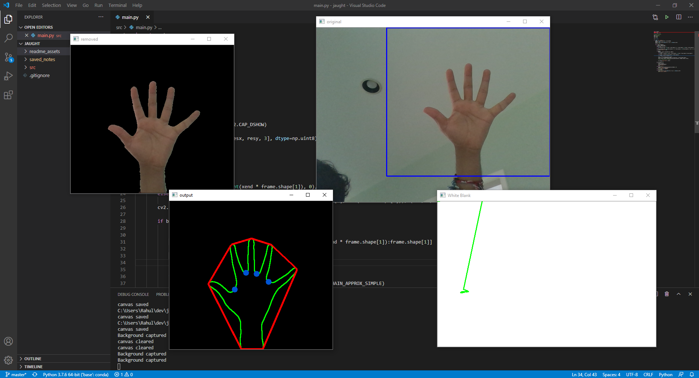

# Jaught

`Jaught` is a virtual whiteboard system that uses the popular computer vision library OpenCV to write notes via finger tracking. 

### Built With
* [Python](https://www.python.org/)
* [OpenCV](https://www.opencv.org/)

### Features
* Real-Time hand segmentation & finger tracking
* Clear canvas by swiping horizontally with 5 fingers
* Save canvas by swiping vertically with 5 fingers
* Change font size/color with rotating hand with fingers up

### Features to Come
* More robust light sensitivity handling
* Stablization in background segmentation to reduce fragility
* Switching to neural networks for gesture recognition

## License
Distributed under the MIT License. See `LICENSE` for more information.
